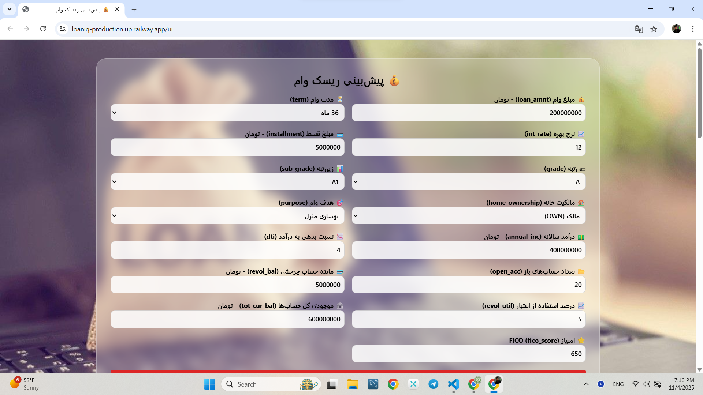
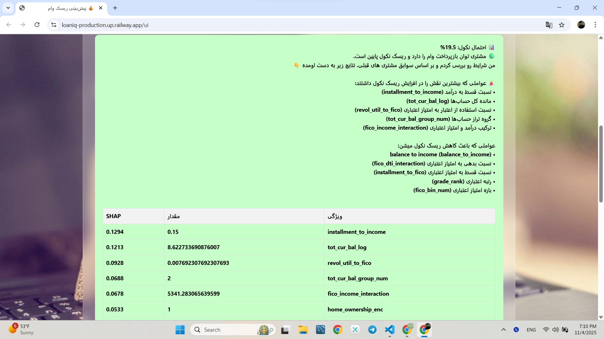
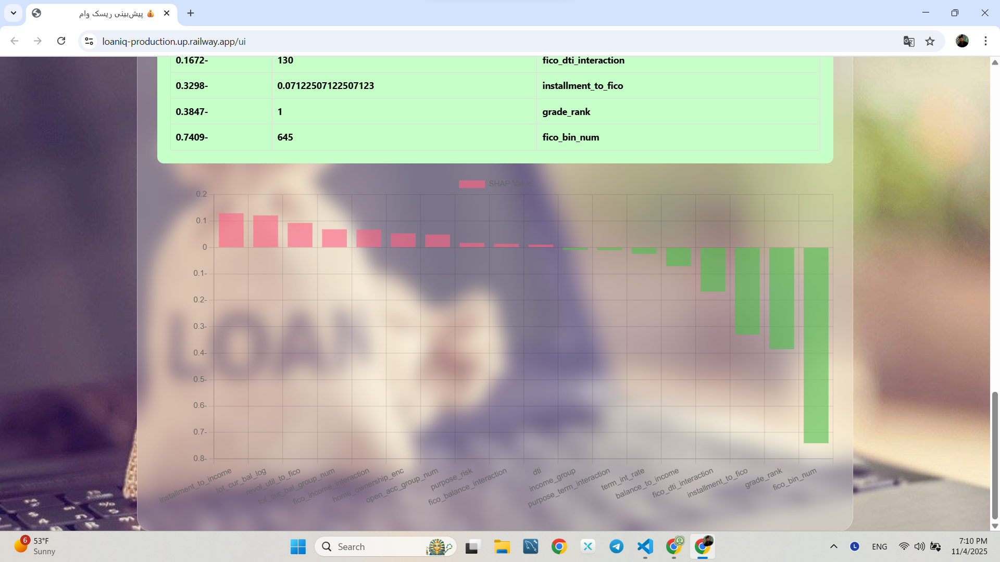
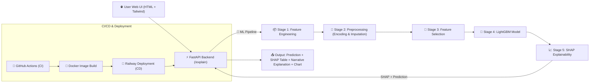
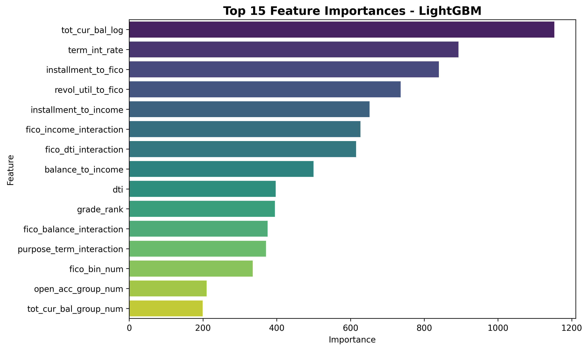
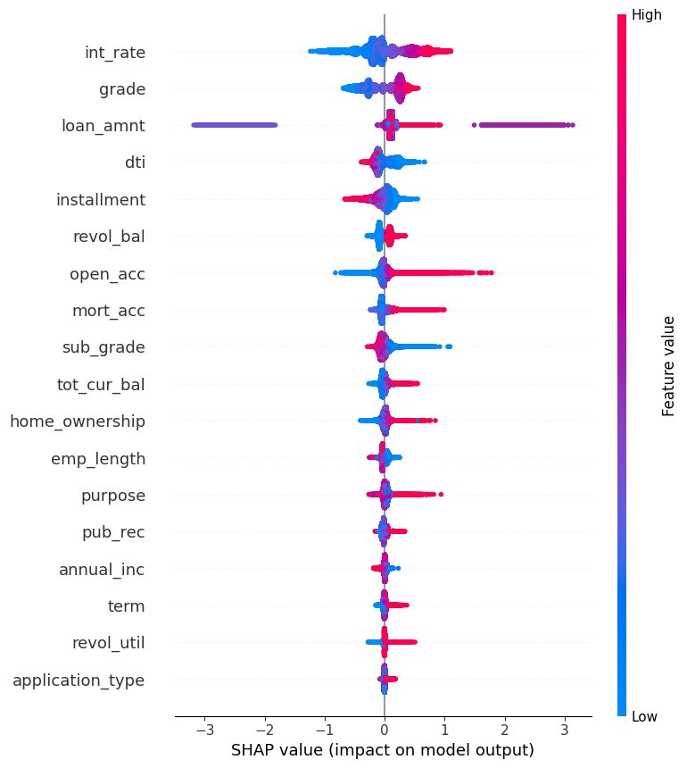
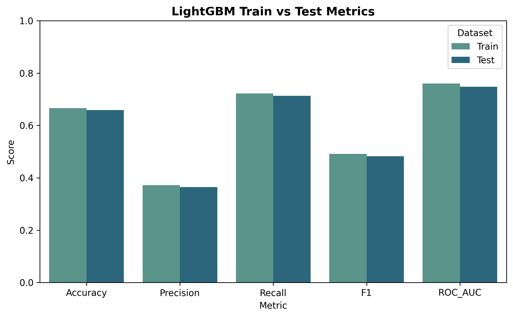

>Fully-automated production ML pipeline (FastAPI + MLflow + Docker + GitHub Actions) deployed on Railway, serving real-time loan default predictions with SHAP explainability.

---

## 🚀 Live Demo  

✅ **Deployed Platforms:**  

- 🧭 **Railway App:**  
  🔗 [https://loaniq-production.up.railway.app](https://loaniq-production.up.railway.app)

- 🤗 **Hugging Face Space:**  
  🔗 [https://Mehdighelich-loan-ml-app.hf.space](https://Mehdighelich-loan-ml-app.hf.space)


### 🎯 UI Preview

Below are live screenshots from the deployed loan risk prediction UI 👇

#### 📥 Loan Input Form


---

#### 📊 SHAP Insight Summary


---

#### 📈 Feature Impact Plot


---

Includes:

- FastAPI real-time default risk prediction ✅
- CI/CD automated deployment pipeline ✅
- Streamlit SHAP dashboard (coming) ✅

---

# 💳 Loan Default Risk Prediction

Predicts the probability that a borrower will default on a loan based on financial, credit, and behavioral variables.
Built for real-world generalization with proper feature engineering and ML workflow management.

---

## 📁 Project Structure

```bash
LOAN/
├── app/                   # FastAPI + SHAP APIs
├── src/                   # Data prep + feature engineering + training
├── models/                # final_pipeline_LightGBM.pkl
├── notebook/              # EDA + model experiments
├── dataset/               # final dataset + sample records
├── model_outputs/         # Metrics + plots + feature importance
├── mlruns/                # MLflow experiment tracking
├── tests/                 # PyTest suite
├── .github/workflows/     # ✅ GitHub Actions CI/CD
├── Dockerfile
├── requirements.txt
└── sample.json
```

## ✅ Project Summary

✅ EDA on curated credit dataset
✅ Advanced feature engineering (DTI, utilization, binning, interactions)
✅ Models trained: RF, XGB, LightGBM
✅ Final Model: **LightGBM**
✅ Hyperparameter tuning with Optuna
✅ MLflow logging + versioning
✅ Explainability via SHAP
✅ Docker containerized
✅ CI/CD with GitHub Actions
✅ Auto-deploy to Railway on each push 🚀

---


## 🏗️ System Architecture (End-to-End ML Deployment)

The diagram below illustrates the full end-to-end lifecycle of the loan default prediction system — covering the path from user interaction to prediction, explainability, and automated CI/CD deployment.




## 📊 Evaluation Results

📁 *Metrics file:*
[`notebook/Models/model_outputs/LightGBM_metrics.csv`](./notebook/Models/model_outputs/LightGBM/LightGBM_metrics.csv)


| Metric         |      Value |
| -------------- | ---------: |
| Accuracy       |       0.65 |
| AUC-ROC        |   **0.75** |
| Recall (focus) | **0.72** ✅ |
| Precision      |       0.37 |

> 🎯 *Model is intentionally optimized for high recall to reduce false loan approvals (risk-sensitive lending application).*


---

## 📈 Feature Importance

> File: `./notebook/Models/model_outputs/LightGBM/feature_importance.png`>




---

## 🧠 SHAP Summary Plot

> File: `./notebook/Models/model_outputs/LightGBM/shap1.png`
>


---

## 📉 Overfitting Check

> File: `./notebook/Models/model_outputs/LightGBM/LightGBM_overfitting_comparison.png`>




---

## 🧠 SHAP Insights

Most influential factors:

- Interest Rate × Term interaction
- Installment-to-Income ratio
- Credit Grade → numeric rank
- DTI × FICO interactions
- Revolving balance behavior
- Home ownership risk category
- Loan purpose risk coefficient

---

## 🧪 Example Input

```json
{
  "loan_amnt": 200000000,
  "term": "36 months",
  "int_rate": 18,
  "installment": 5000000,
  "grade": "A",
  "sub_grade": "A1",
  "home_ownership": "MORTGAGE",
  "annual_inc": 600000000,
  "purpose": "credit_card",
  "dti": 8,
  "open_acc": 12,
  "revol_bal": 4000000,
  "revol_util": 15,
  "tot_cur_bal": 700000000,
  "fico_score": 650
}
```


## 📦 API Output + SHAP Example

```json
{
  "prediction": "Default Risk",
  "default_probability": 0.7216,
  "threshold": 0.5,
  "shap_summary": [
    {
      "feature": "term_int_rate",
      "shap_value": 0.6029,
      "feature_value": 1320.0
    },
    {
      "feature": "installment_to_income",
      "shap_value": 0.3063,
      "feature_value": 0.732
    },
    {
      "feature": "grade_rank",
      "shap_value": 0.2483,
      "feature_value": 20.0 , ...
    }
  ]
}
```

